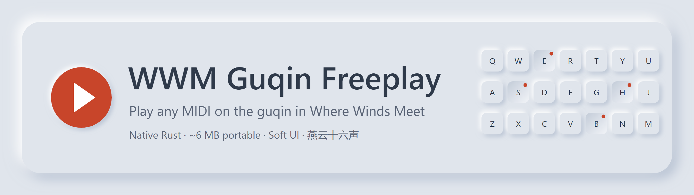
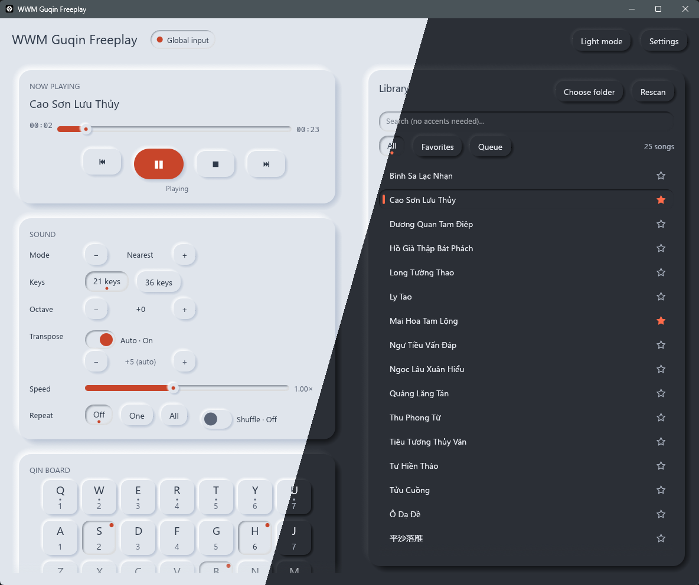
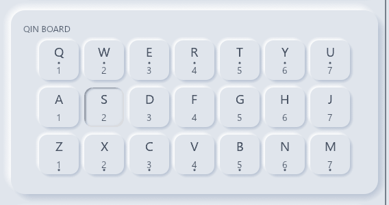
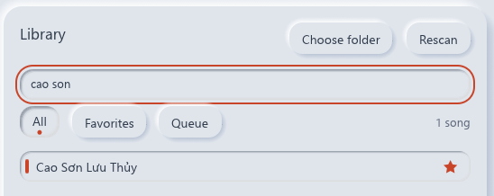
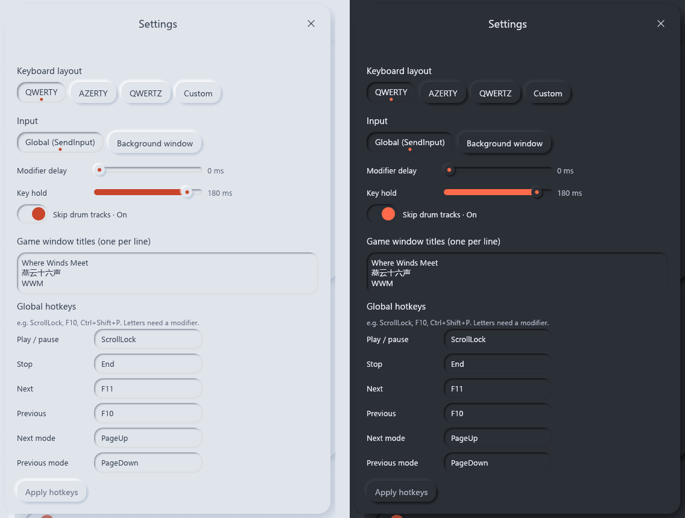
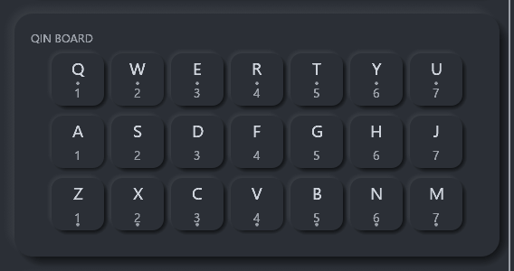

<p align="center">
  
</p>

<p align="center">
  
  
  
  
</p>

<p align="center">
  <a href="https://github.com/k20elite/Where-Winds-Meet-Auto-Play-Guqin-With-.mid-/releases/latest"><b>⬇ Download</b></a>
  &nbsp;·&nbsp; <a href="#-english">English</a>
  &nbsp;·&nbsp; <a href="#-tiếng-việt">Tiếng Việt</a>
</p>

<p align="center">
  
</p>

---

## 🇬🇧 English

**Turn any `.mid` file into a guqin performance in *Where Winds Meet* (燕云十六声) and *Justice Online*.**
Pick a song, press **ScrollLock** in game, and WWM Guqin Freeplay plays every note on time.
It runs as one small portable file, with no Python, no installer and no background services.

### Why players choose it

| | |
|---|---|
| 🎯 **Notes land on the beat** | Reads every tempo change in the MIDI file and times each note to the millisecond. After a lag spike it skips notes that are already too late, so you never hear a stale burst. |
| 🎼 **Sounds right without tweaking** | Auto-transpose picks the key that needs the fewest sharps and flats. Drum tracks are left out, so they never pull the key off. |
| 🎹 **21 or 36 keys** | Natural notes only, or the full chromatic range with Shift/Ctrl. The modifier is tapped and released at once, so it never turns the next note sharp by accident. |
| ⚡ **Fast and tiny** | Native Rust, about **6 MB**. When nothing is playing, the window does not redraw. |
| 🔎 **Finds songs fast** | Handles libraries of 10,000+ files. Search works **without accents**: type `nguoi la` to find *Người Lạ Ơi*. Chinese titles display correctly too. |
| 🎛️ **Hands stay on the game** | Global hotkeys work while the game has focus: play, pause, skip, change mode. |

### See it play

<p align="center">
  
</p>

The **Qin board** mirrors the in-game instrument: three rows of seven keys, each labelled with its
keyboard key and its jianpu (numbered notation) degree. A dot above the number marks the high octave
and a dot below marks the low octave. Keys sink in and get a red dot the moment they are pressed.

### Quick start

1. **Download** `wwm-guqin.exe` from the [latest release](https://github.com/k20elite/Where-Winds-Meet-Auto-Play-Guqin-With-.mid-/releases/latest). No installation is needed.
2. **Run it.** If the game runs as Administrator, run this tool as Administrator too, otherwise Windows blocks its key presses.
3. Click **Choose folder** and select the folder with your `.mid` files.
4. In game, open the guqin. Then click a song, or press **ScrollLock**.

### Hotkeys

| Key | Action |
|---|---|
| `ScrollLock` | Play / pause |
| `End` | Stop |
| `F11` / `F10` | Next / previous song |
| `PageUp` / `PageDown` | Next / previous note mode |

Every hotkey can be changed in **Settings**, including combinations such as `Ctrl+Shift+P`.

### Note modes

| Mode | Best for |
|---|---|
| **Nearest** | Most songs. Every note goes to the closest natural key. |
| **Snap Up** | Songs that sound flat in Nearest. Sharps round up instead of down. |
| **Pentatonic** | Traditional Chinese melodies. Uses only do re mi so la. |
| **Spread** | Piano pieces with a wide range. Low notes stay low and high notes stay high. |
| **Melody** | Vocal lines. Uses only the middle and high rows. |

Switch modes live with `PageUp` / `PageDown`. Combine them with the **octave** buttons and the
**track** switches to fine-tune any arrangement.

### Find any song in seconds

<p align="center">
  
</p>

Star your favorites, build a queue, then play it once, repeat a song, repeat the whole list, or shuffle.

### Make it yours

<p align="center">
  
</p>

- **Keyboard layouts:** QWERTY, AZERTY, QWERTZ, or any 21 keys you choose.
- **Input modes:**
  - **Global** (default) sends hardware-style key presses and is the most reliable.
  - **Background window** sends keys straight to the game window. Shift/Ctrl may not register in this mode.
- **Timing:** key hold time (5–200 ms) and the Shift/Ctrl delay, for slower machines or cloud gaming.
- **Comfort:** light and dark themes, a visible focus ring for keyboard navigation, and it follows the
  Windows "Show animations" setting.

Settings are saved in `wwm-guqin.json` next to the exe, so the whole folder can live on a USB stick.

### Version 2 vs version 1

| | v1 (Python) | **v2 (Rust)** |
|---|---|---|
| Download size | 13.9 MB | **~6 MB** |
| Note mapping | Natural notes only | **5 modes, 21 or 36 keys** |
| Library | One folder list | **Search, favorites, queue, repeat, shuffle** |
| Tracks | All mixed | **Turn each track on or off; drums skipped** |
| Hotkeys | ScrollLock only | **6 actions, all customisable** |
| Source code | Not published | **Open in this repository** |

### Troubleshooting

- **No sound in game:** keep the game window focused while playing (Global mode). If the game runs as
  Administrator, run this tool as Administrator too.
- **A hotkey does nothing:** another app may already use it. Settings shows the conflict; pick another key.
- **The song sounds off:** try another note mode, move the octave, or turn off accompaniment tracks.
- **Wrong keys on a non-English keyboard:** choose your layout under Settings → Keyboard layout.

### Build from source

```bash
git clone https://github.com/k20elite/Where-Winds-Meet-Auto-Play-Guqin-With-.mid-.git
cd Where-Winds-Meet-Auto-Play-Guqin-With-.mid-
cargo build --release          # → target/release/wwm-guqin.exe
cargo test                     # 87 unit tests
```

---

## 🇻🇳 Tiếng Việt

**Biến mọi file `.mid` thành một bản đàn cổ cầm trong *Where Winds Meet* (燕云十六声) và *Nghịch Thủy Hàn*.**
Chọn bài, nhấn **ScrollLock** trong game, WWM Guqin Freeplay sẽ đánh từng nốt đúng nhịp.
Chỉ một file nhỏ chạy ngay: không cần Python, không cần cài đặt, không chạy ngầm.

### Vì sao nên dùng

| | |
|---|---|
| 🎯 **Đúng nhịp** | Đọc mọi thay đổi tempo trong file MIDI và canh từng nốt tới mili-giây. Khi máy bị giật, nốt đã trễ quá sẽ được bỏ qua thay vì dồn ra một tràng. |
| 🎼 **Nghe hay ngay** | Tự dịch giọng sang tông ít nốt thăng/giáng nhất. Track trống được bỏ qua nên không làm lệch tông. |
| 🎹 **21 hoặc 36 phím** | Chỉ nốt tự nhiên, hoặc đủ thăng/giáng bằng Shift/Ctrl. Phím phụ được nhả ngay nên không làm nốt sau bị thăng nhầm. |
| ⚡ **Nhanh và nhẹ** | Viết bằng Rust, chỉ khoảng **6 MB**. Khi không phát nhạc, cửa sổ không vẽ lại. |
| 🔎 **Tìm bài cực nhanh** | Chạy tốt với thư viện hơn 10.000 file. Tìm kiếm **không cần gõ dấu**: gõ `nguoi la` ra ngay *Người Lạ Ơi*. Tên bài tiếng Trung hiển thị đầy đủ. |
| 🎛️ **Không rời tay khỏi game** | Phím tắt toàn cục dùng được ngay trong game: phát, tạm dừng, đổi bài, đổi chế độ. |

### Xem đàn chạy

<p align="center">
  
</p>

**Qin board** mô phỏng đúng cây đàn trong game: 3 hàng × 7 phím, mỗi phím ghi phím bấm và số ký âm
(giản phổ). Chấm trên con số là quãng tám cao, chấm dưới là quãng tám thấp. Phím đang được bấm sẽ
lõm xuống và hiện chấm đỏ.

### Bắt đầu nhanh

1. **Tải** `wwm-guqin.exe` ở [bản phát hành mới nhất](https://github.com/k20elite/Where-Winds-Meet-Auto-Play-Guqin-With-.mid-/releases/latest). Không cần cài đặt.
2. **Mở file.** Nếu game chạy bằng quyền Administrator, hãy mở tool bằng quyền Administrator, nếu không Windows sẽ chặn phím.
3. Bấm **Choose folder**, chọn thư mục chứa file `.mid`.
4. Vào game, mở đàn. Bấm vào bài hát hoặc nhấn **ScrollLock**.

### Phím tắt

| Phím | Chức năng |
|---|---|
| `ScrollLock` | Phát / tạm dừng |
| `End` | Dừng |
| `F11` / `F10` | Bài kế / bài trước |
| `PageUp` / `PageDown` | Chế độ nốt kế / trước |

Đổi được mọi phím tắt trong **Settings**, kể cả tổ hợp như `Ctrl+Shift+P`.

### Chế độ nốt

| Chế độ | Phù hợp với |
|---|---|
| **Nearest** | Đa số bài. Mỗi nốt về phím tự nhiên gần nhất. |
| **Snap Up** | Bài nghe bị "chìm" ở Nearest. Nốt thăng làm tròn lên. |
| **Pentatonic** | Nhạc cổ phong Trung Hoa. Chỉ dùng do re mi sol la. |
| **Spread** | Bài piano có âm vực rộng. Nốt trầm giữ trầm, nốt cao giữ cao. |
| **Melody** | Giai điệu lời hát. Chỉ dùng hàng giữa và hàng cao. |

Đổi chế độ ngay khi đang phát bằng `PageUp` / `PageDown`. Kết hợp nút **octave** và bật/tắt
**track** để chỉnh bất kỳ bản phối nào.

### Tìm bài trong vài giây

<p align="center">
  
</p>

Gắn sao bài yêu thích, xếp hàng chờ, rồi phát một lần, lặp một bài, lặp cả danh sách hoặc phát ngẫu nhiên.

### Tùy chỉnh theo ý bạn

- **Bố cục bàn phím:** QWERTY, AZERTY, QWERTZ hoặc tự chọn 21 phím.
- **Chế độ gửi phím:**
  - **Global** (mặc định) gửi phím như bàn phím thật, ổn định nhất.
  - **Background window** gửi thẳng vào cửa sổ game. Shift/Ctrl có thể không ăn ở chế độ này.
- **Thời gian:** thời gian giữ phím (5–200 ms) và độ trễ Shift/Ctrl, cho máy yếu hoặc chơi qua cloud.
- **Dễ chịu cho mắt:** giao diện sáng/tối, viền focus rõ khi dùng bàn phím, và tôn trọng tùy chọn
  "Show animations" của Windows.

Cài đặt lưu trong `wwm-guqin.json` cạnh file exe, nên có thể chép cả thư mục sang USB.

### Bản 2 so với bản 1

| | v1 (Python) | **v2 (Rust)** |
|---|---|---|
| Dung lượng | 13,9 MB | **~6 MB** |
| Cách map nốt | Chỉ nốt tự nhiên | **5 chế độ, 21 hoặc 36 phím** |
| Thư viện | Danh sách một thư mục | **Tìm kiếm, yêu thích, hàng chờ, lặp, ngẫu nhiên** |
| Track | Trộn chung | **Bật/tắt từng track, tự bỏ track trống** |
| Phím tắt | Chỉ ScrollLock | **6 chức năng, đổi được hết** |
| Mã nguồn | Không công khai | **Công khai trong repo này** |

### Xử lý sự cố

- **Game không ra tiếng:** giữ cửa sổ game được chọn khi phát (chế độ Global). Nếu game chạy quyền
  Administrator, hãy chạy tool cũng bằng quyền Administrator.
- **Phím tắt không hoạt động:** có thể app khác đã chiếm phím đó. Settings sẽ báo, hãy chọn phím khác.
- **Bài nghe sai:** thử chế độ nốt khác, đổi octave hoặc tắt các track đệm.
- **Sai phím với bàn phím không phải tiếng Anh:** chọn bố cục ở Settings → Keyboard layout.

---

## Safety · An toàn

- The tool presses keys with `SendInput` and listens for hotkeys with `RegisterHotKey`. Antivirus
  programs sometimes flag this as macro behavior. It has **no network code**, and the full source is in
  this repository, so you can build the exe yourself.
- *Tool gửi phím bằng `SendInput` và nghe phím tắt bằng `RegisterHotKey`, nên đôi khi bị antivirus cảnh
  báo nhầm. Tool **không kết nối mạng**, toàn bộ mã nguồn nằm trong repo này để bạn tự build.*

> ⚠️ **Disclaimer / Lưu ý:** Third-party tools may break the game's terms of service. Use at your own
> risk. *Công cụ bên thứ ba có thể vi phạm điều khoản của game. Bạn tự chịu trách nhiệm khi sử dụng.*

<p align="center">
  Made with ♪ by <b>WhiteRaven</b>. Find me in game, or open an issue if you have questions.
  <br/>
  <sub>Được làm với ♪ bởi <b>WhiteRaven</b>. Gặp mình trong game hoặc mở issue nếu có thắc mắc.</sub>
</p>
