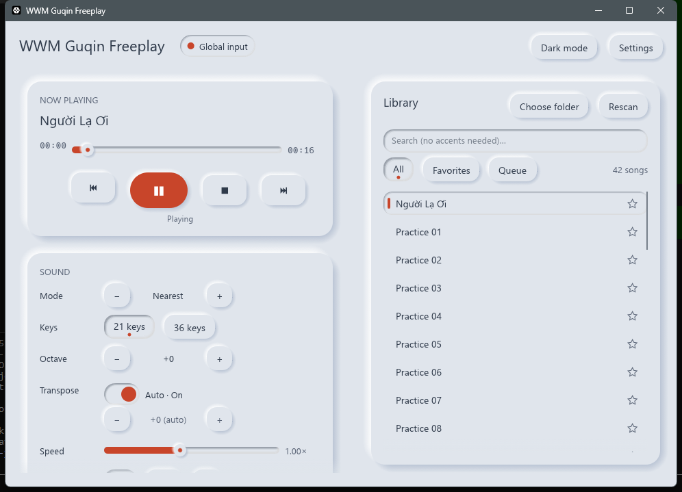
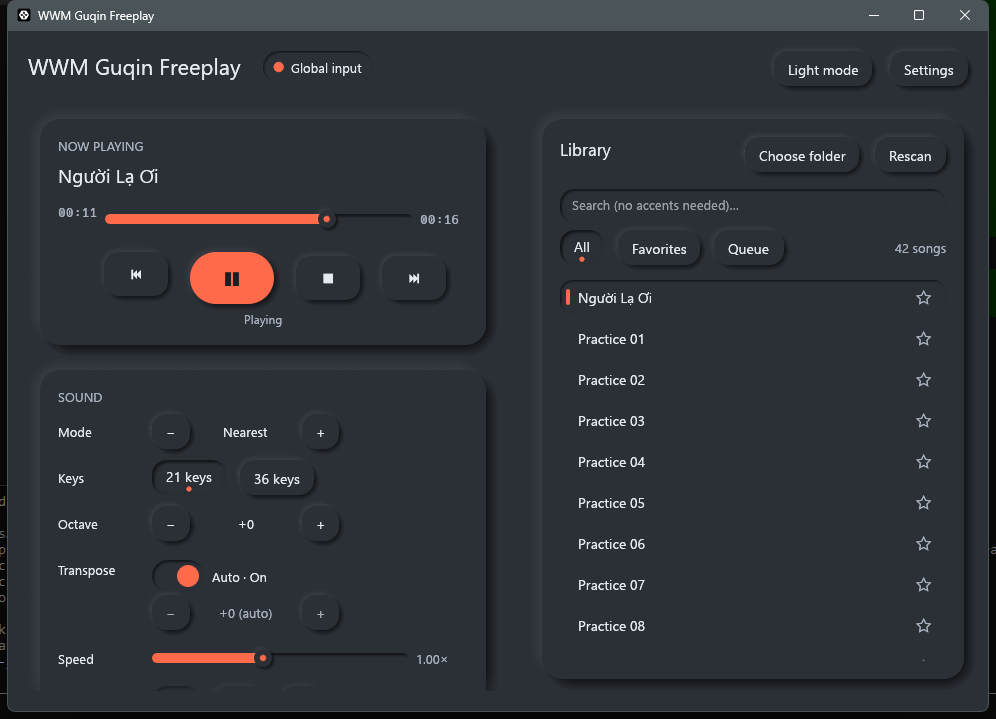

# WWM Guqin Freeplay

Play MIDI files on the guqin in *Where Winds Meet* (燕云十六声) and *Justice Online*.
Version 2 is a full rewrite in **Rust**: a single portable ~6 MB `.exe`, no Python, no WebView.

<p align="center">
  
  
</p>

---

## 🇬🇧 English

### Features

- **Fast and light:** native Rust + egui, ~6 MB exe, near-zero CPU while idle.
- **Accurate timing:** full tempo-map parsing, 1 ms timer resolution with a final spin wait,
  late-note protection (no burst of stale notes after a lag spike).
- **21 or 36 keys:** natural notes only, or sharps/flats via momentary Shift/Ctrl combos
  (the modifier is released immediately, so it never bleeds into other notes).
- **5 note modes:** Nearest, Snap Up, Pentatonic, Spread, Melody. Switch them live.
- **Smart auto-transpose:** picks the key that needs the fewest accidentals. Drum tracks are ignored.
- **Track control:** turn single MIDI tracks on/off; drum tracks are skipped by default.
- **Library:** scans folders (10,000+ files), searches without Vietnamese accents
  (`nguoi la` finds *Người Lạ*), favorites, queue, repeat one/all, shuffle.
- **Global hotkeys** (work while the game has focus):

  | Key | Action |
  |---|---|
  | `ScrollLock` | Play / pause |
  | `End` | Stop |
  | `F11` / `F10` | Next / previous song |
  | `PageUp` / `PageDown` | Next / previous note mode |

  All hotkeys can be changed in **Settings**.
- **Keyboard layouts:** QWERTY, AZERTY, QWERTZ, or your own 21 keys.
- **Two input modes:** *Global* (SendInput scan codes, default, most reliable) or
  *Background window* (posts keys to the game window; Shift/Ctrl may not register).
- **Soft UI** light and dark themes, keyboard focus rings, and support for the Windows
  "Show animations" setting.

### Usage

1. Download `wwm-guqin.exe` from **Releases** and run it. Running as **Administrator** is
   recommended if the game runs elevated.
2. Click **Choose folder** and pick a folder with `.mid` files.
3. Open the guqin in game, then click a song or press **ScrollLock**.
4. If a song sounds wrong, try another note mode (`PageUp`/`PageDown`), the octave buttons,
   or turn off noisy tracks.

Settings are saved to `wwm-guqin.json` next to the exe (portable).

### Build from source

```bash
rustup default stable
cargo test
cargo build --release   # target/release/wwm-guqin.exe
```

---

## 🇻🇳 Tiếng Việt

**WWM Guqin Freeplay** tự động chơi file MIDI trên đàn cổ cầm trong *Where Winds Meet* và
*Nghịch Thủy Hàn*. Bản 2 viết lại hoàn toàn bằng **Rust**: một file `.exe` ~6 MB, chạy ngay,
không cần Python.

### Tính năng

- **Nhanh, nhẹ:** gần như không tốn CPU khi rảnh.
- **Đúng nhịp:** đọc đầy đủ tempo, timer 1 ms, tự bỏ nốt trễ khi máy giật.
- **21 hoặc 36 phím:** chỉ nốt tự nhiên, hoặc thêm thăng/giáng bằng Shift/Ctrl.
- **5 chế độ nốt** đổi ngay khi đang chơi; **tự dịch giọng** thông minh (bỏ qua track trống).
- **Bật/tắt từng track**, mặc định bỏ track trống (drums).
- **Thư viện:** quét thư mục, tìm kiếm **không cần gõ dấu** (`nguoi la` → *Người Lạ*),
  yêu thích, hàng chờ, lặp lại, phát ngẫu nhiên.
- **Phím tắt toàn cục:** `ScrollLock` phát/tạm dừng, `End` dừng, `F11`/`F10` bài kế/trước,
  `PageUp`/`PageDown` đổi chế độ nốt. Đổi được trong **Settings**.
- **Giao diện Soft UI** sáng/tối.

### Cách dùng

1. Tải `wwm-guqin.exe` ở mục **Releases** rồi mở. Nên chạy **Run as Administrator**.
2. Bấm **Choose folder**, chọn thư mục chứa file `.mid`.
3. Vào game, mở đàn, bấm vào bài hát hoặc nhấn **ScrollLock**.
4. Nếu bài nghe sai: đổi chế độ nốt, chỉnh octave, hoặc tắt bớt track.

---

### Security note / False positives

The tool sends keystrokes with `user32.SendInput` and listens for global hotkeys with
`RegisterHotKey`. Antivirus heuristics sometimes flag this as macro/bot behavior. The program is
local only: it has no network code. The full source is in this repository, so you can build the
exe yourself.

### ⚠️ Disclaimer

Provided "as-is" for educational purposes. Third-party tools may break the game's terms of
service. Use at your own risk.

My in-game name is **WhiteRaven**. DM me if there are any issues.
